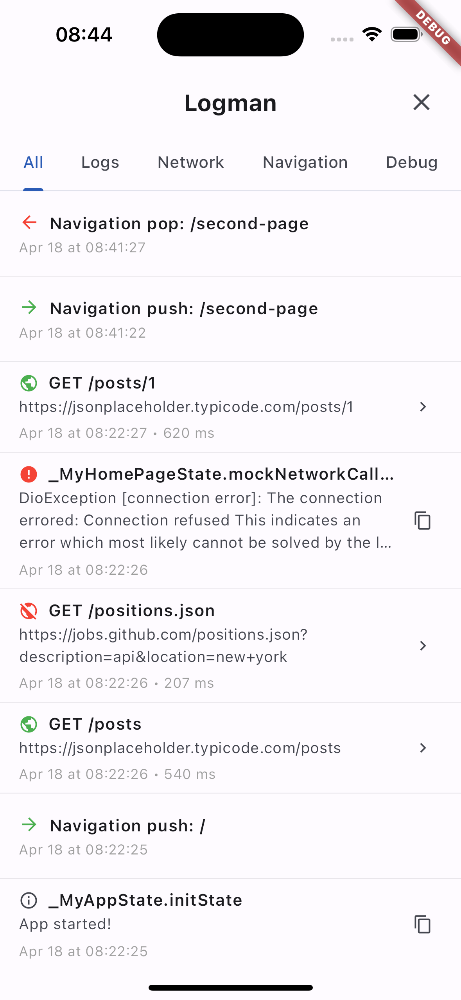
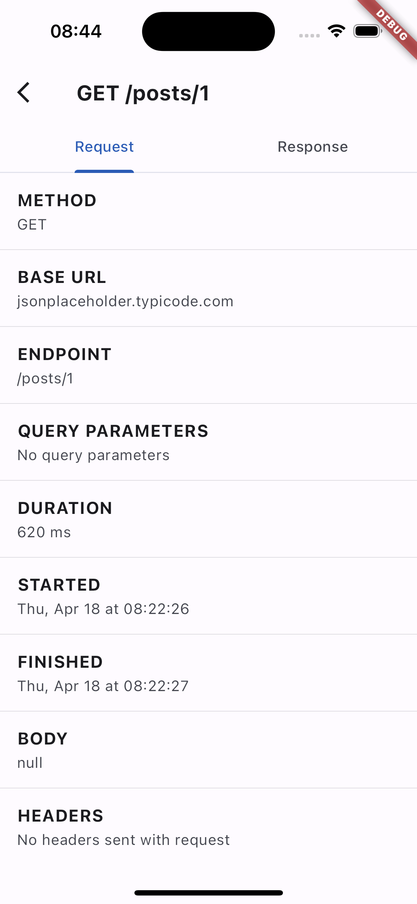
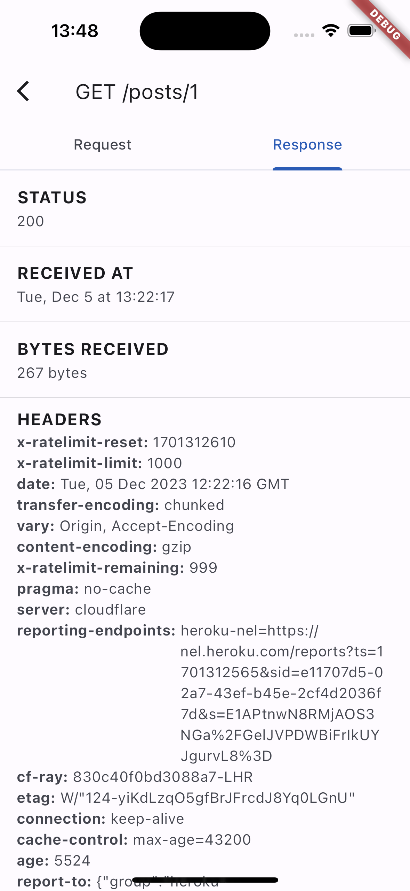
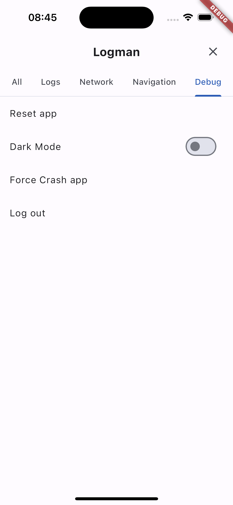

# Logman

A simple yet powerful logging package for Flutter apps with an integrated UI and an optional debug page.

## Features

- Easy-to-use logging with a singleton pattern.
- Supports various log types: simple, navigation, and network logs.
- Customizable floating UI overlay to display logs in development.
- Optional debug page for detailed log analysis.
- Dio interceptor for network logging.
- Navigator observer for tracking navigation events.


## Screenshots

  
  


## Installation

1. Add Logman to your **pubspec.yaml** file:

```yaml
dependencies:
  logman: ^[latest_version]
```
Replace [latest_version] with the latest version of Logman.

2. Install it:

```
flutter packages get
```

3. Import it in your Dart code:

```
import 'package:logman/logman.dart';
```
## Usage
Initialize Logman in your app's root (after MaterialApp) and use its instance throughout your app.

1. Attach the Overlay:
    
```dart
@override
void initState() {
   super.initState();
   WidgetsBinding.instance.addPostFrameCallback((_) {
      logman.attachOverlay(
         context: context,
         debugPage: // Your optional debug page,
         button: // Your optional custom button,
      );
   });
}
```

2. Log events

There are 3 types of logs currently (simple, navigation, and network).

```dart
final Logman _logman = Logman.instance;

_logman.recordSimpleLog('test');
```

There's a (Dio interceptor ready for use in the example app) [https://github.com/Sorcel-Tech/logman.dart/blob/main/example/lib/logman_dio_interceptor.dart].
Also, Logman ships with a Navigator Observer. You can use it like this in your MaterialApp.

```dart
MaterialApp(
  title: 'Logman Demo',
  theme: ...,
  home: const MyHomePage(title: 'Logman Demo Home Page'),
  navigatorObservers: [
    LogmanNavigatorObserver(), // Navigator observer
  ],
)
```

## Example
Find a complete example [here](https://github.com/Sorcel-Tech/logman.dart/blob/main/example/lib/main.dart). 

## Contributing
We welcome contributions! Please read our contribution guidelines for more information.

## License
Logman is released under the Apache 2.0 License.
